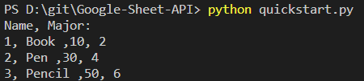

## 1. Google Sheet API

#### + Google API Doc:  
https://developers.google.com/sheets/api/quickstart/python

#### + Google Sheet :  
https://docs.google.com/spreadsheets/d/1PDYcOPH6D_HBtH4NP3CmMuFSyKgKiu-NFaWlZhxMu9k/edit?usp=sharing

#### + API Key:  
https://console.developers.google.com/apis/credentials

#### + GET Method:  
https://sheets.googleapis.com/v4/spreadsheets/1PDYcOPH6D_HBtH4NP3CmMuFSyKgKiu-NFaWlZhxMu9k/values/products!A1:D5?key=API_KEY

#### + Install Python Library:  
```
pip install --upgrade google-api-python-client google-auth-httplib2 google-auth-oauthlib
```
#### + Run:   
```python
python quickstart.py
```


---  

## 2. Google Script Example for Google Sheet  

### + Google Sheet
https://docs.google.com/spreadsheets/d/1_JGGOYqwX3wQ8QtXs6iyxZ0HBOTu15wJtvhqWOtJxXo/edit?usp=sharing


### + Google Script 
```
GoogleScript.gs
```

#### + GET Method:  
https://script.google.com/macros/s/AKfycbwolm39hrs0j3IT_snyMzmwY0Rcvl-AO4WYWXnCNLR4bg4b6Bdc/exec?queryText=2&lang=th


#### + POST Method:  
POST : https://script.google.com/macros/s/AKfycbwolm39hrs0j3IT_snyMzmwY0Rcvl-AO4WYWXnCNLR4bg4b6Bdc/exec
JSON :   
```
  {
  "queryResult": {
    "queryText": "1",
    "parameters": {
      "number": 1,
      "lang": "th"
    }
   }
  }
```